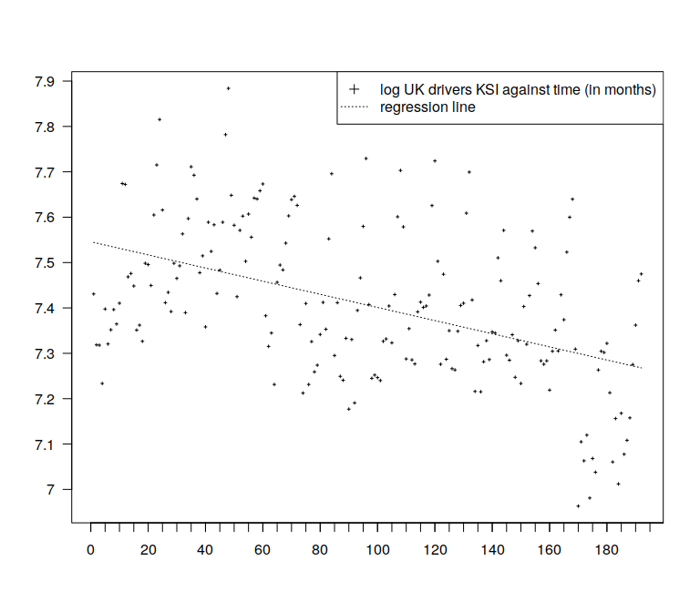

Introduction
============

The standard regression model for *n* observations of *y* and *x* is written as
*y*<sub>*i*</sub> = *a* + *b**x*<sub>*i*</sub> + *ϵ*<sub>*i*</sub>,  *ϵ*<sub>*i*</sub> ∼ 𝒩(0, *σ*<sub>*ϵ*</sub><sup>2</sup>)

``` r
ukksi <- scan("ukksi.txt")
logukksi <- log(ukksi)
x <- 1:192
```

``` r
mod1 <- lm(logukksi ~ x)
summary(mod1)
```

    ## 
    ## Call:
    ## lm(formula = logukksi ~ x)
    ## 
    ## Residuals:
    ##      Min       1Q   Median       3Q      Max 
    ## -0.33649 -0.10850 -0.01256  0.10368  0.40749 
    ## 
    ## Coefficients:
    ##               Estimate Std. Error t value Pr(>|t|)    
    ## (Intercept)  7.5458427  0.0219747 343.387  < 2e-16 ***
    ## x           -0.0014480  0.0001975  -7.333 6.31e-12 ***
    ## ---
    ## Signif. codes:  0 '***' 0.001 '**' 0.01 '*' 0.05 '.' 0.1 ' ' 1
    ## 
    ## Residual standard error: 0.1517 on 190 degrees of freedom
    ## Multiple R-squared:  0.2206, Adjusted R-squared:  0.2165 
    ## F-statistic: 53.77 on 1 and 190 DF,  p-value: 6.313e-12

``` r
anova(mod1)
```

    ## Analysis of Variance Table
    ## 
    ## Response: logukksi
    ##            Df Sum Sq Mean Sq F value    Pr(>F)    
    ## x           1 1.2367  1.2367  53.775 6.313e-12 ***
    ## Residuals 190 4.3696  0.0230                      
    ## ---
    ## Signif. codes:  0 '***' 0.001 '**' 0.01 '*' 0.05 '.' 0.1 ' ' 1

``` r
aov(logukksi ~ x)
```

    ## Call:
    ##    aov(formula = logukksi ~ x)
    ## 
    ## Terms:
    ##                        x Residuals
    ## Sum of Squares  1.236708  4.369631
    ## Deg. of Freedom        1       190
    ## 
    ## Residual standard error: 0.1516511
    ## Estimated effects may be unbalanced

A scatter plot of variable *y* on *x* together with the best fitting line according to classical linear regression.

``` r
plot(logukksi,pch=3,xaxt="n",xlab="",ylab="",yaxt="n",cex=.3)
axis(1, at=seq(0,200,by=5),labels=rep("",length(seq(0,200,by=5))))
axis(1,at=seq(0,200,by=20),labels=seq(0,200,by=20))
axis(2,at=seq(7.0,7.9,by=0.1),labels=seq(7.0,7.9,by=0.1),las=1)
lines(fitted(mod1) ~ x,lty=3)
legend("topright",
       legend=c("log UK drivers KSI against time (in months)","regression line"),
       lty=c(NA,3),pch=c(3,NA))
```



The equation of the regression line is
$$
\\hat{y\_i} = \\hat{a} + \\hat{b}x\_i = 7.5458  + (-0.00145 x\_i )\\\\
$$
 with error variance *σ*<sub>*ϵ*</sub><sup>2</sup> = 0.0229981.

``` r
n <- length(ukksi)
n
```

    ## [1] 192

``` r
S <- t(logukksi - coef(mod1)[1] - coef(mod1)[2]*x)%*%(logukksi - 
                                  coef(mod1)[1] - coef(mod1)[2]*x)
s2hat <- as.numeric(S/(n-2))
s2hat
```

    ## [1] 0.02299806

The standardt F-test yields *F* = 53.774.

Predicted Values and Residuals
==============================

``` r
ei <- residuals(mod1)
```

Log of the number of UK drivers KSI plotted as time series.

``` r
plot(logukksi,pch=3,xaxt="n",xlab="",ylab="",yaxt="n",type="l")
axis(1,at=seq(0,200,by=20),labels=seq(0,200,by=20))
axis(2,at=seq(7.0,7.9,by=0.1),labels=seq(7.0,7.9,by=0.1),las=1)
legend("topright",
       legend=c("log UK drivers KSI"),
       lty=c(1))
```


Residuals of classical linear regression of the log of the number of UK drivers KSI on time.

``` r
plot(ei,pch=3,xaxt="n",xlab="",ylab="",yaxt="n",type="l",lty=3)
axis(1,at=seq(0,200,by=20),labels=seq(0,200,by=20))
axis(2,at=round(seq(-0.3,0.4,by=0.1),1),labels=round(seq(-0.3,0.4,by=0.1),1),las=1)
legend("topleft",
       legend=c("residuals"),
       lty=3)
abline(h=0)
```


Correlogram of classical regression residuals.

``` r
acf(ei,lag.max=15,main="ACF-regression residuals")
```


``` r
##abline(h=c(-ll,ll),lty=3)
```

``` r
yt <- logukksi
as.numeric(t(yt)%*%yt)
```

    ## [1] 10536.89

``` r
yt.hat <- fitted(mod1)

as.numeric(t(yt.hat + ei)%*%(yt.hat + ei))
```

    ## [1] 10536.89

``` r
ss.model <- as.numeric(t(yt.hat)%*%yt.hat)
ss.model
```

    ## [1] 10532.52

``` r
ss.res <- as.numeric(t(ei)%*%ei)
ss.res
```

    ## [1] 4.369631

``` r
ss.model + ss.res
```

    ## [1] 10536.89

``` r
ss.total.unc <- as.numeric(t(yt)%*%yt)
ss.total.unc
```

    ## [1] 10536.89

``` r
b0 <- coef(mod1)[1]
b1 <- coef(mod1)[2]

## ss.model
n*mean(yt)^2 + (b1^2)*as.numeric(t(x - mean(x))%*%(x - mean(x)))
```

    ##        x 
    ## 10532.52

``` r
ss.total.unc - ss.model
```

    ## [1] 4.369631

``` r
ss.res
```

    ## [1] 4.369631

``` r
ss.regr <- (b1^2)*as.numeric(t(x - mean(x))%*%(x - mean(x)))
ss.regr
```

    ##        x 
    ## 1.236708

``` r
ss.regr + ss.res
```

    ##        x 
    ## 5.606339
